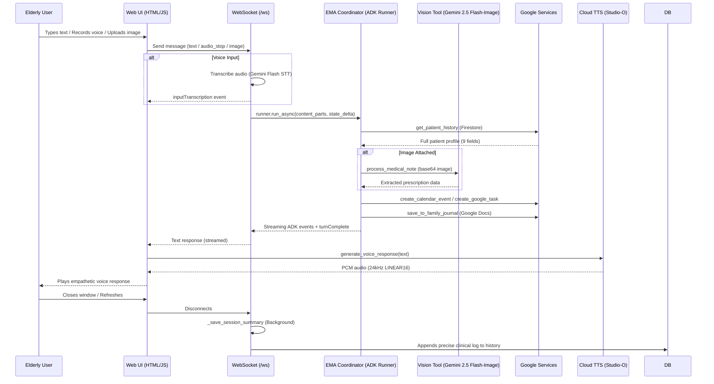
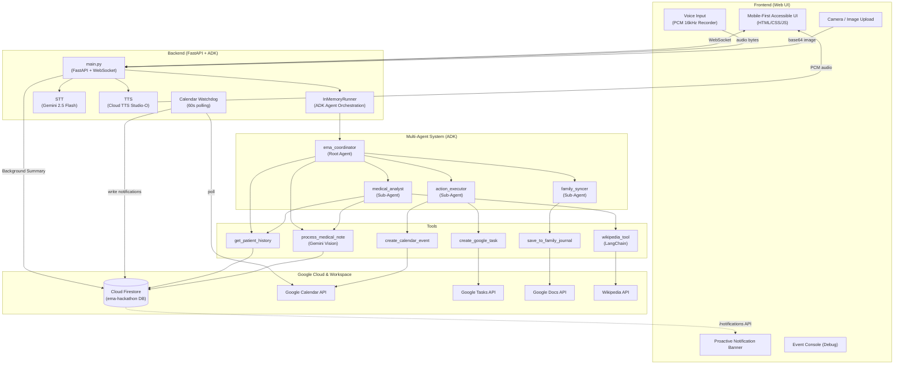

The project documentation for **EMA - Elderly Medical Assistant** is detailed below, for Gen AI Academy APAC Edition Hackathon.

---

# 📋 Project Documentation: EMA (Elderly Medical Assistant)

**Gen AI Academy APAC Edition Hackathon**

---

## 🚀 Hackathon Judge's Testing Guide (Zero Configuration)

To make judging as frictionless as possible, EMA is hosted live. **You do not need to install anything, configure APIs, or set up credentials.**

### How to test:
EMA is fully integrated into the Google Workspace ecosystem (Docs, Tasks, Calendar). The best way to experience the multimodal features is to watch it control these services in real-time.

1. **Open the Live App:**
2. **Open the Family Journal (Google Doc):** https://docs.google.com/document/d/14rNKzVnwmrOJ_1HPHrxB5CpvGt7ndzip27lQo5V5zqM/edit?usp=sharing
3. **Open the Appointment Calendar (Google Calendar):** https://calendar.google.com/calendar/u/2?cid=MmExZjI4OTU4N2I3NGU5ODI1NGQ5YjBkZjJlNmEzYjc2OTMwZDg2OTZkMDFlYjBiZjM1MjE0NGY3MzNhZjY4MkBncm91cC5jYWxlbmRhci5nb29nbGUuY29t


### Try these prompts:
* **Patient Assistant (EMA - Left Panel)**:
  - **Profile Fetching:** *"Hi, I am Ahmad. Can you remind me of my current conditions?"*
  - **Action Execution:** *"Can you schedule my next follow-up appointment for next Tuesday at 10 AM?"* (Watch the Google Calendar update live!)
  - **Family Syncing:** *"Please update my family members and save a summary of my condition to the journal."* (Watch the Google Doc update live!)
  - **Vision AI:** Upload the sample medical note from the repo (`test_assets/ema-medical-note.jpg` and `test_assets/ema-medical-prescription.jpg`) and ask: *"Can you explain what this note says in simple terms?"*
* **Decision Support Console (EMA Grid - Right Panel)**:
  - **Outbreak Trends Query:** *"analyze recent health trends in the North District"* (Watch the Grid Agent query BigQuery and render stats instantly!)
  - **Outbreak Severity Query:** *"where are the cardiac outbreaks located?"*

*(Note on Google Tasks: Because Google Tasks enforces strict privacy and does not support public sharing links, tasks are securely generated and stored in the backend Service Account's private task list. You can verify execution success via the agent's conversational response!)*

---

## 1. Idea & Problem Statement

**The Problem:**
Elderly patients often face a "medical communication gap." After a doctor's appointment, they are frequently overwhelmed by complex medical jargon, leading to confusion, anxiety, and poor treatment adherence. Furthermore, at the system level, healthcare providers and public health officials lack real-time, privacy-preserving data insights to identify outbreak spikes, track disease trends, and optimize resources.

**The Idea:**
- **EMA (Elderly Medical Assistant):** A multimodal, multi-agent, AI-driven assistant designed to be a patient's health companion, translating clinical language into layman's terms and automating logistics (calendars, tasks).
- **EMA Grid:** An AI-powered Decision Intelligence Platform that aggregates anonymized patient metadata into **Google Cloud BigQuery** to help healthcare officials visualize regional outbreak hotspots, track trends, and optimize resource/staff distribution in real-time.

---

## 2. Our Solution

**Approach:**
We leverage the **Google Agent Development Kit (ADK)** and the **Gemini 2.5 Pro & Flash** models to build a dual-interface platform:

* **Real-Problem Addressed:** Health literacy and administrative burden in geriatric care on the patient side; resource allocation and outbreak intelligence on the provider/system side.
* **Practical Impact:** Patient autonomy and medical adherence on one side; real-time operational readiness and epidemic tracking on the other.
* **Core Workflow:**
    * **Patient Side (EMA):**
        1. **Multimodal Input:** Patients type, upload medical notes/prescriptions, or speak to EMA.
        2. **Context Retrieval:** Pulls comprehensive patient data from **Cloud Firestore** (conditions, medications, allergies, doctor, full visit history) to provide continuity.
        3. **Vision Intelligence:** Uses **Gemini 2.5 Flash-Image** to extract structured data from prescriptions and handwritten notes.
        4. **Jargon Translation & Scheduling:** Explains conditions/medications in plain language, automates scheduling in **Google Calendar** and **Google Tasks**, and appends summaries to a shared **Google Doc Family Journal**.
        5. **Proactive Alerts:** Calendar Watchdog polls events and sends upcoming notifications.
        6. **Empathetic Voice Output:** Streams natural speech generated by **Google Cloud TTS (Studio-O)**.
        7. **Privacy-Preserving Upload:** At session end, EMA auto-summarizes patient metrics and pushes them to **Google Cloud BigQuery** (completely sanitizing any PII).
    * **Official Side (EMA Grid):**
        1. **Live Map & Insights Dashboard:** Officials open the EMA Grid panel showing active hotspots and staffing predictions driven by BigQuery.
        2. **Natural Language Querying:** Query the Grid Agent via chat (e.g. "Which region has the highest spike in respiratory issues this week?") to make data-driven resource decisions.

---

## 3. The Opportunities & USP

**Difference from Existing Solutions:**
Traditional public health systems operate on a delayed, post-clinical timeline—officials only learn about outbreaks after patients visit clinics, undergo tests, and have their files processed through manual administrative registries. 

**EMA Grid** completely flips this paradigm by capitalizing on the **novelty of pre-clinical agentic telemetry inherited from the patient-facing EMA assistant**:
1. **Pre-Clinical Outbreak Signals**: The moment an elderly patient consults EMA about their symptoms or scans a prescription, the patient-side agent parses the symptoms, sanitizes all PII, and streams the raw, pre-clinical telemetry (symptoms, region, severity) directly to **Google Cloud BigQuery** in real time upon session end. 
2. **Zero-Delay Data Loop**: Public health officials and emergency teams see regional outbreaks and health spikes on the **EMA Grid Dashboard** *days* before they would manifest in official clinical reports.
3. **Conversational SQL Execution**: Officials don't need database expertise or analyst teams to query these telemetry trends. The ADK-powered **Grid Decision Agent** translates natural language questions into complex, optimized BigQuery SQL, runs the query, and generates actionable, data-driven workforce recommendations in seconds.

**Unique Selling Propositions (USP):**

### 🏥 System-Facing USPs (EMA Grid)
* **Real-Time Pre-Clinical Outbreak Mapping**: Direct, privacy-preserving pipeline from patient-agent conversations to BigQuery, providing immediate regional heatmaps and case counts.
* **Predictive Workforce & Staffing Alerts**: Automatically calculates regional case volumes and alerts officials with high-contrast priority tags (STABLE, WARNING, CRITICAL) advising exact nursing staff relocations.
* **Zero-Code Decision Support**: The ADK Grid Analyst translates natural language into BigQuery queries, formats telemetry results in interactive tables, and provides analytical resource allocation advice on the very first turn.

### 📱 Patient-Facing USPs (EMA)
* **Empathetic Multimodal Support**: Seamlessly transitions between text, voice input (STT), voice output (TTS Studio-O), and prescription scans (Vision AI) to assist elderly patients.
* **Layman-Friendly Medical Translation**: Every clinical jargon, condition, and medication is simplified with concrete analogies and cited Wikipedia definitions.
* **Workspace Automation**: Connects directly to Google Workspace to schedule follow-up appointments (Google Calendar), set medication reminders (Google Tasks), and log updates for children (Google Docs Family Journal).
* **Closed-Loop Memory**: Automatically generates and saves a clinical session log to Firestore when a patient logs off, maintaining long-term continuity.

---

## 4. List of Features

| Feature | Description |
|---|---|
| **Frictionless Patient Recognition** | Identity-safe lookup for multiple patients (Ahmad, Zaiton) without exposing internal IDs |
| **Comprehensive Health Profile** | Presents name, age, doctor, conditions, medications, allergies, visit history — all in layman terms |
| **Multimodal Medical Note Parser** | Scans and interprets physical doctor notes and prescriptions using Gemini Vision |
| **Medical Jargon Interpreter** | Translates complex terms into simple sentences with Wikipedia citations and links |
| **Automated Scheduling** | Converts doctor's instructions into Google Calendar events with proper time zones |
| **Medication & Task Management** | Creates specific Google Tasks with dosages and instructions |
| **Real-Time Family Journal** | Generates compassionate summaries and appends them to a shared Google Doc |
| **Proactive Calendar Watchdog** | Background service polls Calendar every 60s and surfaces upcoming appointment alerts |
| **Voice Input (STT)** | Records PCM audio at 16kHz, transcribes via Gemini 2.5 Flash |
| **Voice Output (TTS)** | Generates natural speech via Google Cloud TTS (Studio-O, 24kHz), streamed as PCM over WebSocket |
| **Camera & Image Upload** | Take photos via device camera or upload from gallery, with image preview and removal |
| **Live Event Console** | Developer-friendly console panel showing raw ADK events for debugging |
| **Notification Banner** | Animated banner displaying proactive appointment reminders from the Watchdog |
| **Patient Record Updates** | Automatically summarizes the session and saves a precise clinical log to Firestore upon disconnection using Gemini 2.5 Flash, maintaining closed-loop memory without relying on manual agent tool calls. |
| **Outbreak Heatmapping** | Displays a visual heatmap of symptoms by region using data stored in BigQuery. |
| **Resource & Staffing Advisor** | High-contrast alerts indicating predicted healthcare workforce shortages or needed shifts based on regional symptom clusters. |
| **Grid Decision Agent** | A second ADK conversational agent running on the official panel, answering queries about regional health statistics and recommending resource allocation in natural language. |
| **Privacy-Preserving BQ Pipeline** | Seamlessly pushes aggregated, PII-free patient metadata (e.g. only symptom categories, timestamps, and regions) to BigQuery. |

---

## 5. Process Flow Diagram



---

## 6. Architecture Diagram



---

## 6.1 UI Wireframe & Layout

The user interface is designed specifically for elderly patients: large text, icon-only functional buttons
```
+---------------------------------------------------------------------------------------------------+
|  EMA: Elderly Medical Assistant & Decision Intelligence Dashboard                                 |
+---------------------------------------------------------------------------------------------------+
|               LEFT PANEL: EMA (Patient)           |          RIGHT PANEL: EMA Grid (Official)     |
| +-----------------------------------------------+ | +-------------------------------------------+ |
| | [Voice On/Off]                                | | |  [ Outbreak Heatmap: Respiratory Spike ]   | |
| | +-------------------------------------------+ | | |  [ Alerts: Hospital staffing low in Reg A] | |
| | | User: Hi EMA, can you read this note?     | | | +-------------------------------------------+ |
| | +-------------------------------------------+ | | | Official: Is influenza spreading?         | |
| | | EMA: This is a prescription for Lisinopril| | | | Grid Agent: Yes, BigQuery shows a 14%    | |
| | +-------------------------------------------+ | | | increase in influenza symptoms in Reg A.  | |
| +-----------------------------------------------+ | +-------------------------------------------+ |
| | [Text input]         [Upload] [Camera] [Mic]  | | | [Text input to Grid Agent]                | |
| +-----------------------------------------------+ | +-------------------------------------------+ |
+---------------------------------------------------------------------------------------------------+
```

---

## 7. Agent Architecture

The system runs two concurrent multi-agent systems built on the Google Agent Development Kit (ADK):

### A. Patient Side: `ema_coordinator` (Gemini 2.5 Flash)
Manages patient triage, jargon translation, scheduling, and family syncing:
- **medical_analyst:** Interprets medical jargon, scans notes with vision, searches Wikipedia.
- **action_executor:** Schedules events in Google Calendar and creates Google Tasks.
- **family_syncer:** Summarizes the session and saves updates to the Google Doc Family Journal.

### B. Official Side: `grid_coordinator` (Gemini 2.5 Pro)
Provides Decision Intelligence using BigQuery data:
- **grid_data_analyst:** Uses the `query_bigquery_trends` tool to query the `ema_grid` dataset and return outbreak trends, hotspots, and recommend resource/staffing allocation.

---

## 8. Project Structure

```
EMA/
├── main.py                    # FastAPI server, WebSocket endpoints for EMA & Grid, TTS/STT, Watchdog
├── ema_agent/                 # EMA Patient agent package
│   ├── __init__.py
│   ├── agent.py               # Coordinator + 3 sub-agents
│   └── tools.py               # Firestore, Calendar, Tasks, Docs, Vision, Wikipedia tools
├── grid_agent/                # EMA Grid Decision agent package
│   ├── __init__.py
│   ├── agent.py               # Grid Coordinator + BQ Analyst agent
│   └── tools.py               # BigQuery trend analysis tools
├── scripts/
│   └── generate_bq_data.py    # Standalone script to populate BigQuery dataset with dummy data
├── ui/
│   ├── index.html             # Single-page web app split into EMA and EMA Grid panels
│   ├── css/
│   │   └── style.css          # Styling for split-panel layout, dashboard charts, and chat UI
│   └── js/
│       ├── app.js             # Main JS logic establishing dual WebSocket connections and dashboard rendering
│       ├── audio-player.js
│       ├── audio-recorder.js
│       ├── pcm-player-processor.js
│       └── pcm-recorder-processor.js
├── documentation/             # Project docs, dev plans
├── requirements.txt           # Python dependencies (updated with google-cloud-bigquery)
├── Dockerfile
├── cloudbuild.yaml
├── .env                       # Environment variables (including BigQuery dataset settings)
└── .dockerignore
```    # Cloud Build CI/CD pipeline
├── .env                       # Environment variables (local dev)
└── .dockerignore              # Docker build exclusions
```

---

## 9. Technology Stack

| Layer | Technology | Purpose |
|---|---|---|
| **AI Model** | Gemini 2.5 Flash (Vertex AI) | Reasoning, orchestration, STT transcription |
| **AI Vision** | Gemini 2.5 Flash-Image | Medical note/prescription parsing |
| **Agent Framework** | Google ADK (v1.17.0) | Multi-agent orchestration with `InMemoryRunner` |
| **Text-to-Speech** | Google Cloud TTS (Studio-O) | Natural voice output (LINEAR16 PCM, 24kHz) |
| **Backend** | FastAPI + Uvicorn | WebSocket server, REST APIs |
| **Database** | Cloud Firestore (`ema-hackathon`) | Patient records, notification storage |
| **Data Warehouse** | Google Cloud BigQuery | Anonymized patient symptom telemetry database |
| **Calendar** | Google Calendar API | Appointment scheduling |
| **Tasks** | Google Tasks API | Medication and task reminders |
| **Docs** | Google Docs API | Shared family journal |
| **Knowledge** | Wikipedia API (LangChain) | Medical condition context and citations |
| **Logging & Trace** | Google Cloud Logging | Container execution trace and error diagnostics |
| **Frontend** | Vanilla HTML/CSS/JS | Mobile-first accessible chat UI |
| **Fonts** | Google Fonts (Inter, Outfit) | Modern typography |
| **Icons** | Material Symbols Rounded | UI iconography |
| **Markdown** | marked.js | Agent response rendering |
| **Deployment** | Cloud Run + Cloud Build | Containerized hosting with CI/CD |
| **Runtime** | Python 3.12 (Docker) | Server runtime |

---

## 10. Google Services Used

| Service | How It's Used |
|---|---|
| **Gemini 2.5 Flash** | Core reasoning, agent orchestration, audio transcription |
| **Gemini 2.5 Flash-Image** | High-accuracy medical document/prescription parsing |
| **Google Cloud Text-to-Speech** | Empathetic voice responses (Studio-O female voice) |
| **Google Agent Development Kit (ADK)** | Multi-agent framework with session management |
| **Cloud Firestore** | Persistent patient records, visit history, notification queue |
| **Google Cloud BigQuery** | Aggregated patient outbreak hotspots and regional metrics |
| **Google Calendar API** | Appointment scheduling and watchdog monitoring |
| **Google Tasks API** | Medication and chore reminders |
| **Google Docs API** | Shared family medical journal (append-only) |
| **Vertex AI** | Model hosting and inference |
| **Cloud Run** | Serverless container hosting |
| **Cloud Build** | CI/CD pipeline for automated deployments |
| **Google Cloud Logging** | Structured server-side logging and system diagnostics |

---

## 11. Setup & Running Locally

### Prerequisites
- Python 3.12+
- Google Cloud project with the following APIs enabled:
  - Vertex AI, Firestore, Calendar, Tasks, Docs, Cloud TTS, **BigQuery**
- Application Default Credentials (`gcloud auth application-default login`)

### Installation

```bash
# Clone the repository
git clone <repo-url> && cd EMA

# Create virtual environment
python3 -m venv .venv
source .venv/bin/activate

# Install dependencies
pip install -r requirements.txt
```

### Environment Variables

Create a `.env` file:

```env
PROJECT_ID=your-gcp-project-id
LOCATION=us-central1
CALENDAR_ID=primary
DOCUMENT_ID=your-google-doc-id
BIGQUERY_DATASET=ema_grid
```

### Setup BigQuery & Generate Dummy Data

For the decision intelligence dashboard demo, run the script to create the BigQuery dataset and populate it with synthetic patient symptom reports representing a simulated outbreak:

```bash
python scripts/generate_bq_data.py
```

### Run

```bash
# Start the server locally
python main.py
# or
uvicorn main:app --host 0.0.0.0 --port 8000
```

Open `http://localhost:8000` in your browser.

---

## 12. Deployment (Cloud Run)

### Using Cloud Build (CI/CD)

```bash
gcloud builds submit \
  --config=cloudbuild.yaml \
  --substitutions=_DOCUMENT_ID=your-google-doc-id
```

### Manual Docker Build

```bash
docker build -t ema-assistant .
docker run -p 8080:8080 \
  -e PROJECT_ID=your-project \
  -e LOCATION=us-central1 \
  -e PORT=8080 \
  ema-assistant
```

---

## 13. Solution Mock-Up (Conversational)

> **User:** "Hai EMA, can you fetch me my medical record?"
>
> **EMA:** "Hello Ahmad! You're 79 years old and our doctor, Dr. Amirah, has been looking after us. We are currently managing:
> - **Type 3 Diabetes** (our body has trouble managing sugar levels)
> - **Stage 3 Kidney Failure** (our kidneys are working at a reduced level)
> - **High blood pressure** (our heart has to work a bit harder to pump blood)
>
> Our medications include:
> - **Metformin** — helps keep blood sugar steady
> - **SGLT2 inhibitors** — helps remove extra sugar and protects our kidneys
>
> ⚠️ **Important:** We are allergic to Seafood.
>
> Is there anything specific you would like to know or discuss about your records today?"

> **User:** *(Uploads photo of prescription)*
>
> **EMA:** "I've carefully analyzed that note for us. I see a new prescription for Lisinopril 10mg from Dr. Amirah. I've added a reminder to take it every morning. I also updated the Family Journal so your children know about the new plan."

---

## 14. Firestore Data Schema

### Collection: `patients`

```json
{
  "name": "Ahmad",
  "age": "79",
  "allergies": "Seafood",
  "conditions": ["Type 3 Diabetes", "Stage 3 Kidney Failure", "High blood pressure", "Blood cancer"],
  "doctor": "Dr. Amirah",
  "medications": ["Biguanides (Metformin)", "SGLT2 inhibitors"],
  "last_visit": "2 April 2026 (Timestamp)",
  "history": [
    { "date": "2026-04-07", "notes": "Ahmad's kidney disease has progressed to Stage 4..." },
    { "date": "2026-04-26", "notes": "Patient reported his doctor said his kidney is becoming stable..." },
    { "date": "2026-04-26", "notes": "CORRECTION: Patient clarified today's date..." }
  ],
  "digitized_notes": []
}
```

### Collection: `notifications`

```json
{
  "title": "Upcoming Appointment",
  "message": "Reminder: 'Follow-up with Dr. Amirah' is coming up soon.",
  "time": "2026-05-11T10:00:00+08:00",
  "created_at": "Timestamp",
  "status": "unread"
}
```

---

## 15. API Endpoints

| Method | Path | Description |
|---|---|---|
| `WebSocket` | `/ws/{user_id}/{session_id}` | Main communication channel for Patient EMA (text, audio, image turns) |
| `WebSocket` | `/ws/grid/{user_id}/{session_id}` | Communication channel for Official EMA Grid Agent |
| `GET` | `/api/grid/dashboard` | Fetches BigQuery-backed aggregated hotspots and staffing alerts |
| `GET` | `/health` | Health check for Cloud Run startup probe |
| `GET` | `/notifications` | Fetches unread watchdog notifications |
| `DELETE` | `/notifications/{doc_id}` | Marks a notification as dismissed |
| `GET` | `/{path}` | Serves the SPA frontend (static files) |

---

## 16. Testing EMA Grid

To verify and test the decision intelligence functionalities of **EMA Grid**, you can run both manual and automated testing scenarios.

### A. Manual Demo Scenario
1. Open the app in your browser at `http://localhost:8000`.
2. Locate the **EMA Grid Decision Console** chat (bottom-right of the screen).
3. Type:
   ```
   analyze recent health trends in the North District
   ```
4. **Expected Response**: The agent will run a BigQuery SQL query to count recent symptom report categories in the North District and display a markdown table showing the distribution, accompanied by a resource allocation recommendation (e.g. suggesting extra nursing staff if respiratory counts exceed 200).

### B. Automated Integration Test
A Python integration test script has been created to test the WebSocket connection and query processing of the Grid Agent.

To execute the test:
1. Ensure your local server is running (`python main.py`).
2. Open a separate terminal window and run:
   ```bash
   python scripts/test_grid_agent.py
   ```
3. **Expected Output**:
   * Connects to `/ws/grid/test-user/test-session`
   * Asserts the agent welcome greeting is received.
   * Asserts that submitting a query returns the correct outbreak analytics table from BigQuery.
   * Prints `Test passed successfully!` upon successful assertion.
